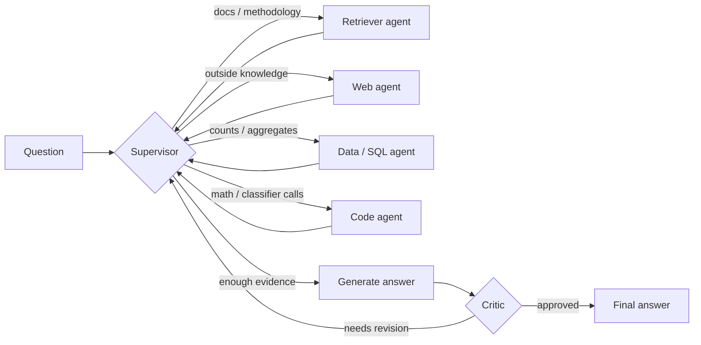

# 🤖 AI Transaction Analyst (Multi-Agent)

**A multi-agent AI system that categorizes financial transactions and answers natural-language questions about them — with a live, streaming trace of the agents thinking, localized to the Uzbek market.**

🔗 **Live demo:** [multi-agent-transaction-analyst.onrender.com](https://multi-agent-transaction-analyst.onrender.com/)

📦 **Code:** [github.com/betauzb9/multi-agent-transaction-analyst](https://github.com/betauzb9/multi-agent-transaction-analyst)

> ⏳ The demo runs on a free Render instance and spins down after inactivity — the first request after a while may take ~50s to wake up.

---

## What it does

Ask questions in **Uzbek, Russian, or English** — the system detects the language and answers in kind — like:

- *"How many transactions fall under 'Dining & Coffee' (Kafe va restoranlar)?"*
- *"What is the category taxonomy used by this system?"*
- *"How does the model handle a previously unseen merchant?"*
- *"What category would a transaction described as 'CLICK KORZINKA #4471' for 85,000 so'm get?"*

...and watch a team of specialist agents route the question, gather evidence, draft an answer, and have it checked by a critic before it's shown — all visible in real time in the UI.

## How it works

A **supervisor agent** routes each question to one or more specialists, then a **critic agent** verifies the drafted answer against the evidence before approving it (or sending it back for revision):



- **ML core** — a scikit-learn text classifier assigns a spending category to a raw transaction (merchant text + amount + type), falling back to `Other / Uncategorized` when confidence is low rather than guessing.
- **Retriever agent** — answers "why/how" questions from the ingested methodology and taxonomy docs (embedded, local Qdrant vector store).
- **Data (SQL) agent** — runs read-only queries over the categorized-transactions database.
- **Code agent** — runs sandboxed Python for exact math/aggregation, or calls the trained classifier directly on a new transaction.
- **Web agent** — optional, answers questions outside the local docs/database (skips gracefully without a Tavily key).
- **Critic** — rejects an answer that states a number not backed by the SQL/code evidence, capped at a fixed number of revision passes so the graph always terminates.
- **Memory** — recalls earlier turns so follow-up questions ("...and last quarter?") have context.
- **Answer language matching** — the generation step detects the language the question was asked in and writes the final answer in that same language, independent of the (Uzbek) language of the underlying docs/database.

## Localized to the Uzbek market

The sample transaction data (`data/generate_synthetic_data.py`) mirrors real local
payment-system statement text rather than generic US merchants:

- Merchant text follows **Payme / Click / Uzcard / Humo / P2P** statement formats
  (e.g. `CLICK KORZINKA #4471`, `PAYME *ISH HAQI TO'LOVI`)
- Real Uzbek merchants and services: Korzinka, Makro, Yandex Go, Beeline/Ucell/Uzmobile,
  Uzbekistan Airways, etc.
- Amounts in **so'm (UZS)**, at realistic ranges per category
- 12 category labels in Uzbek (`Oziq-ovqat`, `Kafe va restoranlar`, `Transport`, ...),
  documented in `docs/category_taxonomy.md`

To plug in a real business's transactions instead of the synthetic set, see
"Using your own data" below.

## Tech stack

| Layer | Tools |
|---|---|
| Agent orchestration | [LangGraph](https://github.com/langchain-ai/langgraph), [LangChain](https://github.com/langchain-ai/langchain) |
| LLM + embeddings | Google Gemini (`gemini-2.5-flash`, `text-embedding-004`) — free tier, no card |
| Vector store | [Qdrant](https://qdrant.tech/) (embedded, local, no signup) |
| Structured data | SQLite |
| Classifier | scikit-learn (TF-IDF + linear model) |
| Frontend | [Gradio](https://www.gradio.app/) |
| Observability | [Langfuse](https://langfuse.com/) (optional tracing) |
| Deployment | [Render](https://render.com/) (free, always-on web service) |

## Results

| Metric | Score |
|---|---|
| Classifier accuracy (held-out, Uzbek-market synthetic data) | **100%** (`models/eval_report.json`) |
| Classifier macro-F1 (held-out) | **100%** |
| Agent pipeline — avg. LLM-judge score | 4.75 / 5 across a 12-question test set *(from the pre-localization English test set — see note below)* |

> ⚠️ **Both numbers need a caveat.** The 100% classifier accuracy is inflated because
> the current synthetic dataset gives each category a distinct set of merchants with
> almost no overlap — real transaction data (e.g. a supermarket chain that sells both
> groceries and electronics) will score lower and more realistically. The 4.75/5 agent
> score is from `src/eval/testset.json`, which still asks about the **old English
> category names** (e.g. "Dining & Coffee") that no longer exist in the localized
> dataset — update `testset.json` to the new Uzbek category names and re-run
> `python -m src.eval.harness` before quoting this number as current.

## Quickstart

```bash
git clone https://github.com/betauzb9/multi-agent-transaction-analyst.git
cd multi-agent-transaction-analyst
python -m venv .venv && source .venv/bin/activate
pip install -r requirements.txt
cp .env.example .env   # then fill in your own GOOGLE_API_KEY
```

Get a free key (never share one across accounts — rate limits are per key):
- `GOOGLE_API_KEY` — **required**. https://aistudio.google.com/apikey (no card)
- `TAVILY_API_KEY` — optional, enables the web agent. https://tavily.com (no card)
- `LANGFUSE_PUBLIC_KEY` / `LANGFUSE_SECRET_KEY` — optional, tracing. https://cloud.langfuse.com (no card)

```bash
# 1. Build the ML core
python data/generate_synthetic_data.py
python -m src.ml.train_categorizer
python -m src.ingestion            # embeds docs/ into the local vector store

# 2. Ask a question end-to-end (any of the 3 supported languages)
python -m src.graph "Nechta tranzaksiya 'Kafe va restoranlar' toifasiga tushadi?"

# 3. Run the evaluation harness
python -m src.eval.harness

# 4. Launch the UI
python app.py
```

Open `http://localhost:7860` in your browser.

## Using your own data

By default the system runs on the localized synthetic dataset above. To connect
a real business's transactions instead:

1. Export a CSV from your bank/Payme/Click account.
2. Map the columns to `date, description, amount, txn_type, category`
   (`category` can be left blank — the model will predict it).
3. Replace `data/transactions.csv` and `data/company.db` with the real data.
4. Re-run `python -m src.ml.train_categorizer` and check the accuracy in
   `models/eval_report.json` — expect it to be lower (and more realistic) than
   the synthetic-data number above.
5. Push the changes to GitHub — Render will redeploy automatically (see below).

Details: `docs/methodology.md` §1.

## Deploying on Render

**Build Command:**
```bash
pip install -r requirements.txt && python data/generate_synthetic_data.py && python -m src.ml.train_categorizer && python -m src.ingestion
```
(Skip `generate_synthetic_data.py` if `data/transactions.csv` already holds real committed data.)

**Start Command:**
```bash
python app.py
```

**Environment Variables (Render dashboard → Environment):**
| Variable | Required | Notes |
|---|---|---|
| `GOOGLE_API_KEY` | ✅ Yes | Gemini LLM + embedding calls |
| `TAVILY_API_KEY` | Optional | Enables the web agent |
| `LANGFUSE_PUBLIC_KEY` / `LANGFUSE_SECRET_KEY` | Optional | Tracing |
| `PYTHONUNBUFFERED` | Recommended | Set to `1` so build logs stream live instead of buffering, which makes a stuck build much easier to diagnose |

> 💡 If a deploy freezes for a long time with no error, check `GOOGLE_API_KEY` first —
> the `src.ingestion` step calls the Gemini embedding API, and an invalid/expired key
> can cause it to hang without ever printing an error.

## Project structure

```
data/            Uzbek-market synthetic transaction data generator
docs/            category taxonomy, methodology, and limitations — ingested by the retriever agent
models/          trained classifier + evaluation report
src/
  config.py      reads settings from .env
  state.py       shared agent state
  llm.py         LLM + embeddings client factory
  ingestion.py   builds the vector store from docs/
  ml/            classifier training, features, and inference
  agents/        retriever, web, data (SQL), code, supervisor, critic
  graph.py       LangGraph wiring — the multi-agent flow
  memory.py      long-term memory over past turns
  eval/          test set + evaluation harness (LLM-judge / RAGAS)
  observability.py   optional Langfuse tracing
app.py           Gradio frontend + deployment entry point
```

## Known limitations

- The bundled dataset is synthetic (though Uzbek-market-realistic); a real dataset should be swapped in before drawing production conclusions (see `docs/methodology.md`).
- A genuinely novel merchant with no overlap with training data falls back to `Other / Uncategorized` rather than being correctly labeled.
- The critic is itself an LLM and reduces, but doesn't eliminate, the chance of an incorrect answer slipping through.
- `src/eval/testset.json` still targets the pre-localization English category names — update it and re-run `python -m src.eval.harness` for an up-to-date agent-quality score.
- Language auto-detection depends on LLM quality and can misfire on very short or mixed-language questions.

See `docs/limitations.md` for the full list of limitations, risks, and recommended next steps.

## License

No license file is currently included — all rights reserved by default. Add a `LICENSE` file (e.g. MIT) if you'd like to allow reuse.
