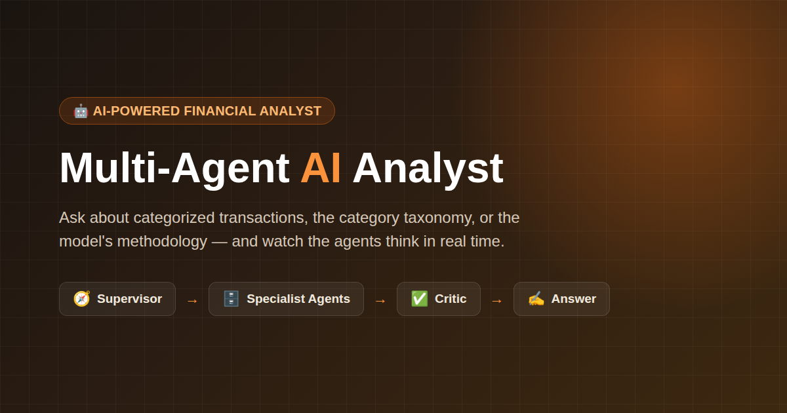
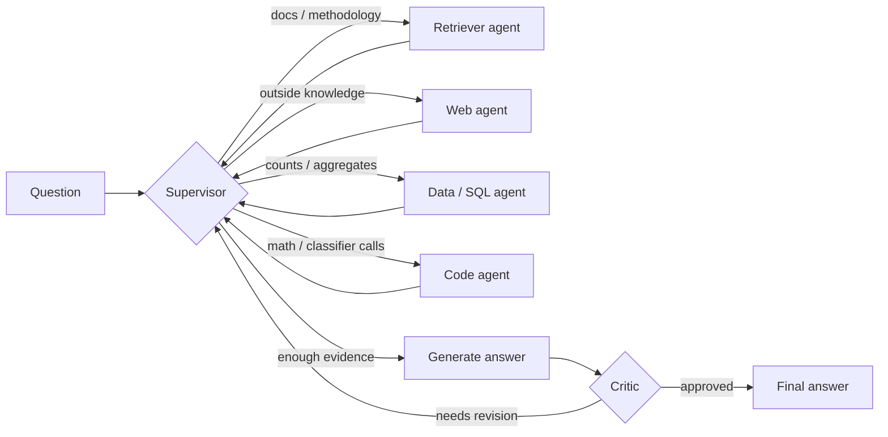

# 🤖 Multi-Agent AI Analyst

**A multi-agent AI system that categorizes financial transactions and answers natural-language questions about them — with a live, streaming trace of the agents thinking.**

🔗 **Live demo:** [multi-agent-transaction-analyst.onrender.com](https://multi-agent-transaction-analyst.onrender.com/)



> ⏳ The demo runs on a free Render instance and spins down after inactivity — the first request after a while may take ~50s to wake up.

---

## What it does

Ask questions like:

- *"How many transactions were categorized as Dining & Coffee?"*
- *"What is the category taxonomy used by this system?"*
- *"How does the model handle a previously unseen merchant?"*
- *"What category would 'SQ \*STARBUCKS #4471' for $5.75 get?"*

...and watch a team of specialist agents route the question, gather evidence, draft an answer, and have it checked by a critic before it's shown — all visible in real time in the UI.

## How it works

A **supervisor agent** routes each question to one or more specialists, then a **critic agent** verifies the drafted answer against the evidence before approving it (or sending it back for revision):



- **ML core** — a scikit-learn text classifier assigns a spending category to a raw transaction (merchant text + amount + type), falling back to `Other / Uncategorized` when confidence is low rather than guessing.
- **Retriever agent** — answers "why/how" questions from the ingested methodology and taxonomy docs (embedded, local Qdrant vector store).
- **Data (SQL) agent** — runs read-only queries over the categorized-transactions database.
- **Code agent** — runs sandboxed Python for exact math/aggregation, or calls the trained classifier directly on a new transaction.
- **Web agent** — optional, answers questions outside the local docs/database (skips gracefully without a Tavily key).
- **Critic** — rejects an answer that states a number not backed by the SQL/code evidence, capped at a fixed number of revision passes so the graph always terminates.
- **Memory** — recalls earlier turns so follow-up questions ("...and last quarter?") have context.

## Tech stack

| Layer | Tools |
|---|---|
| Agent orchestration | [LangGraph](https://github.com/langchain-ai/langgraph), [LangChain](https://github.com/langchain-ai/langchain) |
| LLM + embeddings | Google Gemini (`gemini-2.5-flash`, `text-embedding-004`) — free tier, no card |
| Vector store | [Qdrant](https://qdrant.tech/) (embedded, local, no signup) |
| Structured data | SQLite |
| Classifier | scikit-learn (TF-IDF + linear model) |
| Frontend | [Gradio](https://www.gradio.app/) |
| Observability | [Langfuse](https://langfuse.com/) (optional tracing) |
| Deployment | [Render](https://render.com/) (free, always-on web service) |

## Results

The classifier and the agent pipeline are both evaluated automatically:

| Metric | Score |
|---|---|
| Classifier accuracy (held-out) | **99.65%** |
| Classifier macro-F1 (held-out) | **99.65%** |
| Agent pipeline — avg. LLM-judge score | **4.75 / 5** across a 12-question test set |

## Quickstart

```bash
git clone https://github.com/betauzb9/multi-agent-transaction-analyst.git
cd multi-agent-transaction-analyst
python -m venv .venv && source .venv/bin/activate
pip install -r requirements.txt
cp .env.example .env   # then fill in your own GOOGLE_API_KEY
```

Get a free key (never share one across accounts — rate limits are per key):
- `GOOGLE_API_KEY` — **required**. https://aistudio.google.com/apikey (no card)
- `TAVILY_API_KEY` — optional, enables the web agent. https://tavily.com (no card)
- `LANGFUSE_PUBLIC_KEY` / `LANGFUSE_SECRET_KEY` — optional, tracing. https://cloud.langfuse.com (no card)

```bash
# 1. Build the ML core
python data/generate_synthetic_data.py
python -m src.ml.train_categorizer
python -m src.ingestion            # embeds docs/ into the local vector store

# 2. Ask a question end-to-end
python -m src.graph "How many transactions were categorized as Dining & Coffee?"

# 3. Run the evaluation harness
python -m src.eval.harness

# 4. Launch the UI
python app.py
```

## Project structure

```
data/            synthetic transaction data generator
docs/            category taxonomy, methodology, and limitations — ingested by the retriever agent
models/          trained classifier + evaluation report
src/
  config.py      reads settings from .env
  state.py       shared agent state
  llm.py         LLM + embeddings client factory
  ingestion.py   builds the vector store from docs/
  ml/            classifier training, features, and inference
  agents/        retriever, web, data (SQL), code, supervisor, critic
  graph.py       LangGraph wiring — the multi-agent flow
  memory.py      long-term memory over past turns
  eval/          test set + evaluation harness (LLM-judge / RAGAS)
  observability.py   optional Langfuse tracing
app.py           Gradio frontend + deployment entry point
```

## Known limitations

- The bundled dataset is synthetic; a real dataset should be swapped in before drawing production conclusions (see `docs/methodology.md`).
- A genuinely novel merchant with no overlap with training data falls back to `Other / Uncategorized` rather than being correctly labeled.
- The critic is itself an LLM and reduces, but doesn't eliminate, the chance of an incorrect answer slipping through.

See `docs/limitations.md` for the full list of limitations, risks, and recommended next steps.

## License

No license file is currently included — all rights reserved by default. Add a `LICENSE` file (e.g. MIT) if you'd like to allow reuse.
